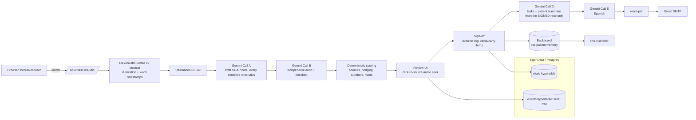
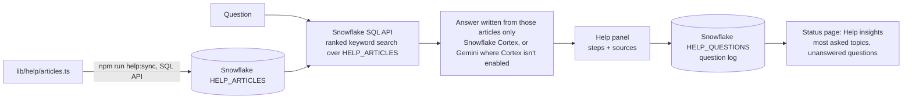

# Carryover

> **AI scribes write the note. Carryover makes sure the note is right, complete, and actually followed through.**

Built at hackUMBC 2026. **Prototype. Not for clinical use. Synthetic data only.**

## The problem

Ambient AI scribes turn a visit recording into a note, and that's where they stop. Three bottlenecks remain:

| Bottleneck | What Carryover does |
|---|---|
| **Editing burden**: doctors proofread the whole AI note | Every sentence cites the transcript lines it came from. Each problem gets a confidence score computed in code, with the reasons shown. The doctor reviews only flagged items and can click any sentence to hear its source audio. |
| **Omissions**: a note can be accurate and still incomplete | A visit-type checklist plus last visit's open items are audited against the transcript. Missed items show up before sign-off; the doctor fills, dismisses (with a reason), or defers them. |
| **Follow-through is manual** | On sign-off: a task list for the office, open items carried to the next visit, and a plain-language patient summary PDF in English or Spanish, emailed after the doctor approves it. |

## Demo flow

1. Log in as Dr. Patel → **Rosa Martinez** (synthetic): pre-visit brief from longitudinal memory, BP trend, 2 open items.
2. **Start visit** → consent checkbox → record the role-play → **End visit**.
3. Processing: transcribe → draft → audit → score.
4. **Review**: the uncertain lisinopril dose ("20… or maybe 40?") is flagged red. Click it to hear the audio. Edit it and the problem badge turns green. Gaps panel: allergy check missing (losartan is new; sulfa allergy on file) and last visit's lab never discussed.
5. **Sign**: unresolved required items need an override reason, which is logged.
6. **Follow-through**: tasks, English + Spanish summary with reading level, PDF preview, **Approve & send**.

## Architecture



Design decisions:

- **Confidence is computed in code, not self-reported by the LLM** ([lib/scoring/confidence.ts](lib/scoring/confidence.ts)). A sentence starts at 1.0 and loses confidence for missing or invalid sources, audit verdicts (unsupported, partial, hedged, contradiction), numbers that don't appear in the cited speech ([lib/scoring/numbers.ts](lib/scoring/numbers.ts) handles "one thirty-eight over eighty-eight"), and unverified medication details. Problem score = 0.5 × min + 0.5 × mean.
- **The audit is a separate call**, so the model checks work it didn't just write.
- **Patient-facing text is generated only from the signed note**, so errors the doctor fixed can't leak to the patient.
- **Doctor in control**: nothing reaches the patient until the doctor signs and approves the send. Machine-translated Spanish needs an explicit "I reviewed it" checkbox.
- **Tiger Data**: `vitals` (BP trend) and `events` (every AI draft, edit, override, and send) are TimescaleDB hypertables.

### Help assistant (Snowflake)

A **Help** button on every page opens a chat that explains, step by step and in plain language, how to use
Carryover, for staff who aren't comfortable with computers. It is retrieval-augmented, and Snowflake is the
knowledge base, the retrieval engine and the analytics store, all through Snowflake's REST APIs
([lib/llm/snowflake.ts](lib/llm/snowflake.ts), shared with the patient chat):



It answers only from the articles, names buttons exactly as they appear, and declines medical questions.
Cortex writes the answer when the account allows AI functions (the Cortex REST API, streamed, or
`SNOWFLAKE.CORTEX.COMPLETE` through the SQL API); trial accounts without a card get neither, so
`SNOWFLAKE_CORTEX=off` hands the writing to Gemini while Snowflake still stores, searches and logs.
Setup: run [scripts/snowflake/setup.sql](scripts/snowflake/setup.sql) once in Snowsight (warehouse, tables,
least-privilege role, service user and access token), set `SNOWFLAKE_ACCOUNT_URL` and `SNOWFLAKE_PAT`, then
`npm run help:sync`. Without Snowflake the panel searches the articles in the app.

## Setup

```bash
npm install
cp .env.example .env.local   # fill in keys (see below)
npm run dev                  # http://localhost:3000
```

The database migrates and seeds itself on first request. With `DATABASE_URL` empty, it uses an embedded
PGlite database in `data/pglite/`, so no setup is needed. For Tiger Cloud, paste the console's service URL into
`DATABASE_URL` and the password into `PGPASSWORD` (the console URL omits it). TLS is verified against Tiger's own
certificate authority in [certs/tiger-ca.pem](certs/tiger-ca.pem). `vitals` and `events` become hypertables automatically.

Demo logins (synthetic): `dr.patel@carryover.demo` / `demo1234`, `dr.nguyen@carryover.demo` / `demo1234`.
Dr. Nguyen can't open Dr. Patel's patients (403).

| Script | What it does |
|---|---|
| `npm run db:reset` | Wipe and re-seed. Stop the dev server first when using PGlite. |
| `npm run db:seed` | Re-seed rows only |
| `npm run db:report` | Read-only summary of what's stored: row counts, hypertables, latest visits and events |
| `npm test` | Unit tests (utterances, scoring, numbers, readability) |
| `npm run lint` / `npm run typecheck` | Run before every commit |
| `npm run demo:audio` | Re-synthesize the placeholder demo audio with Windows voices |
| `npm run fixtures:promote [visitId]` | Copy the last successful live run into `data/fixtures/demo/` (plus that visit's audio) |
| `npm run help:sync` | Load the help articles into Snowflake (SQL API); run after changing `lib/help/articles.ts` |

### Environment

See [.env.example](.env.example). All external calls are server-side, go through one retry/backoff
wrapper ([lib/http.ts](lib/http.ts)), and never log keys.

- `ELEVENLABS_API_KEY`, `ELEVENLABS_STT_MODEL=scribe_v2_medical`, `USE_KEYTERMS` (costs extra)
- `GEMINI_API_KEY`, `GEMINI_MODEL`, `GEMINI_FALLBACK_MODEL`
- `BACKBOARD_API_KEY`, `BACKBOARD_ENABLED`. Without Backboard, the brief falls back to Gemini, then to a deterministic chart summary.
- `EMAIL_PROVIDER=gmail` with `GMAIL_USER` + `GMAIL_APP_PASSWORD` (sends to any address), or `resend`
- `AUTH_SECRET` (32+ chars), `DEMO_PATIENT_EMAIL` (inbox for the seeded demo patient)
- `SNOWFLAKE_ACCOUNT_URL`, `SNOWFLAKE_PAT`, `SNOWFLAKE_WAREHOUSE`, `SNOWFLAKE_CORTEX` (`off` on trial accounts), `SNOWFLAKE_CHAT_MODEL`, `SNOWFLAKE_DAILY_CALL_LIMIT`, `SNOWFLAKE_CORTEX_SEARCH` for the Help assistant

### Demo safety net (`DEMO_FALLBACK=true`)

If an external call fails or takes more than 30 s, the pipeline switches to the committed fixtures in
[data/fixtures/demo/](data/fixtures/demo/) and the UI shows an **offline mode** chip. The record page
has a small **Load demo visit** link that uses the committed demo audio instead of the mic.

> The committed demo audio is a **synthesized placeholder** (Windows text-to-speech of the demo script).
> The transcript, note, audit, and summary fixtures are real ElevenLabs + Gemini output for that audio.
> After a good live run of the real role-play, run `npm run fixtures:promote <visitId>` and commit
> `data/fixtures/demo/` so the fallback replays it.

### Free-tier guards

- Daily caps in [lib/usage.ts](lib/usage.ts): `GEMINI_DAILY_CALL_LIMIT` (default 150 calls),
  `STT_DAILY_AUDIO_MINUTES` (default 30), `MAX_RECORDING_MINUTES` (default 10; the recorder auto-stops).
  Counters live in `data/usage/YYYY-MM-DD.json`. Past a cap, calls are refused and the demo fallback takes over.
- ElevenLabs free plan: 10,000 credits/month, no overage. Measured cost ≈ 66 credits per minute of audio.
- Gemini: Gemini 3 models run with low thinking (much faster); one retry on the main model, then the fallback model.

## Tracks

Health Beyond the Clinic · Community Impact & Social Innovation · Best Entrepreneurial Idea ·
Most Engaging Demo · [MLH] Best Use of ElevenLabs · Gemini API · Tiger Data · Backboard ·
Best Use of Snowflake API

**Impact measurement plan:** per visit, measure seconds from visit end to signed note, flagged vs.
total sentences, gaps caught, share of open items closed by the next visit, and summary delivery in the
patient's preferred language (the review stats card on the follow-through screen). Proposed pilot:
2 clinicians, 4 weeks, compared against their usual workflow.

## Honesty

Synthetic data only; every patient is invented. Not a medical device. A production version would need
BAAs (ElevenLabs offers HIPAA eligibility for Scribe v2 Medical with a BAA and Zero Retention Mode), a
paid Gemini tier (free-tier data may be used to improve Google products), and clinical validation of
the checklists.
